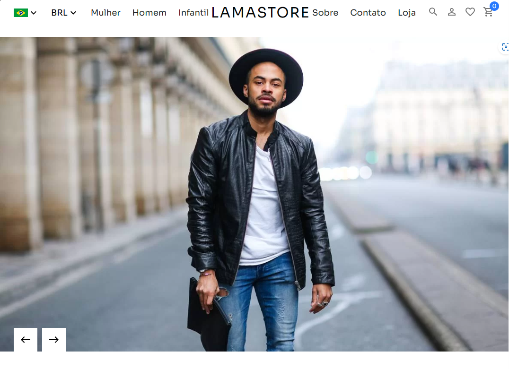

# LamaStore

Este é um projeto de e-commerce construído utilizando as tecnologias Vite, Strapi e Stripe. Este arquivo `readme.md` contém informações sobre como iniciar e configurar o projeto.

<p align="center">
  
</p>

## Requisitos

Antes de começar, certifique-se de ter os seguintes requisitos instalados em sua máquina:

- [Node.js](https://nodejs.org/) (versão 14 ou superior)
- [Yarn](https://yarnpkg.com/) (versão 1 ou superior)

## Inicializando o Projeto

Para começar, siga os passos abaixo:

1. Clone este repositório para sua máquina local:

   ```bash
   git clone https://github.com/luuizz/lama-store.git
2. Dentro da pasta raiz do projeto, execute o seguinte comando para instalar as dependências do Node.js:

    ```bash
    yarn
3. Em seguida, navegue até a pasta api para configurar e iniciar o servidor Strapi:
    ```bash
    cd api
4. Novamente, execute o seguinte comando para instalar as dependências do Node.js na pasta api:
    ```bash
    yarn
5. Agora, inicie o servidor Strapi com o seguinte comando:
    ```bash
    yarn develop
6. O servidor Strapi estará acessível em http://localhost:1337/.

7. Volte para a pasta raiz do projeto
    ```bash
    cd ..
8. Inicie o servidor de desenvolvimento Vite com o seguinte comando:
    ```bash
    yarn dev
O servidor de desenvolvimento Vite estará acessível em http://localhost:5137/.

## Configuração do Stripe

Para configurar o Stripe para processamento de pagamentos, siga as instruções da documentação oficial do Stripe: https://stripe.com/docs.

Certifique-se de configurar as chaves de API do Stripe no seu projeto de acordo com as melhores práticas de segurança.

## Habilitando os Módulos Node na Pasta api

1. Certifique-se de que os módulos Node na pasta api estejam habilitados executando o seguinte comando:
    ```bash
    cd api
    yarn install --production=false
2. Isso garantirá que todos os módulos Node necessários estejam disponíveis na pasta api.

## Contribuição
Fique à vontade para contribuir com melhorias para este projeto. Você pode criar issues, fazer pull requests e contribuir de outras formas para tornar este e-commerce ainda melhor.

## Licença
Este projeto está licenciado sob a Licença MIT.
